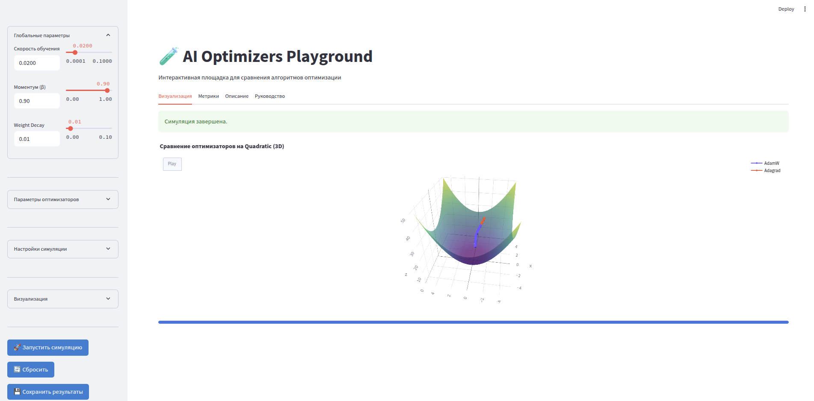
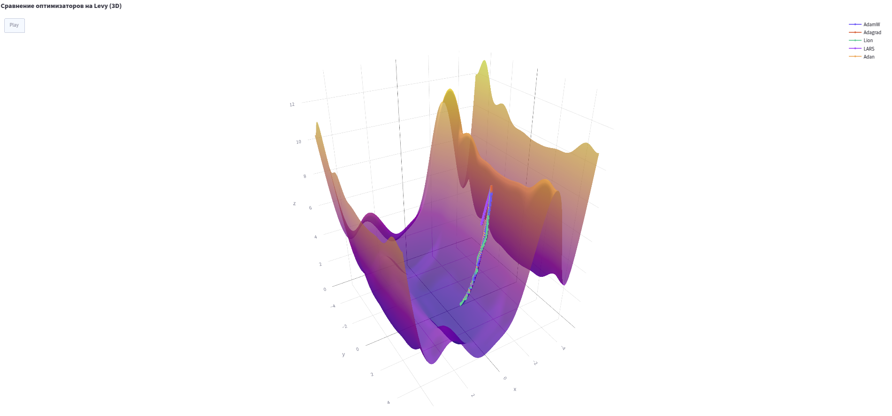
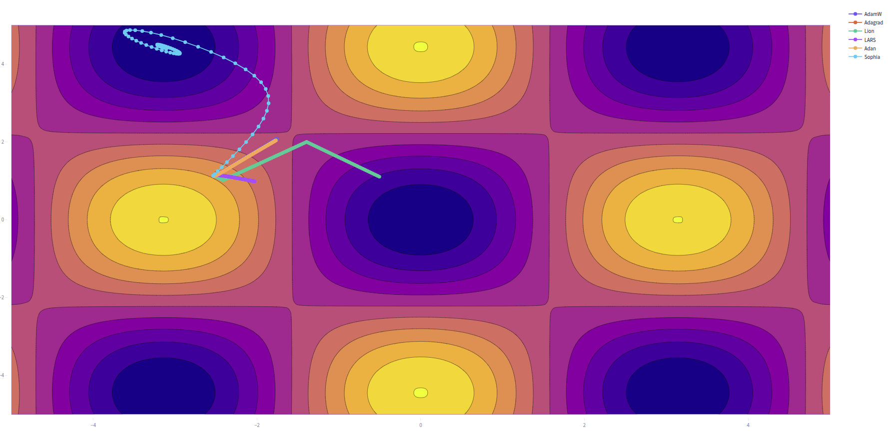
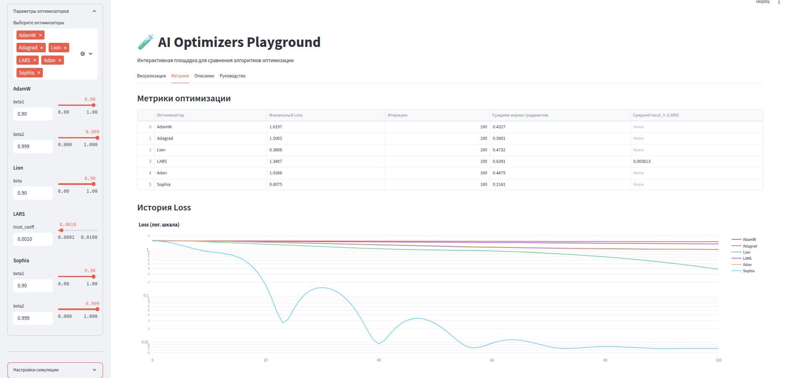
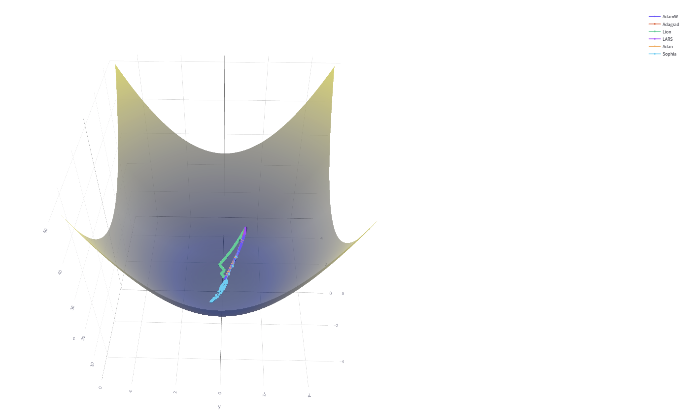
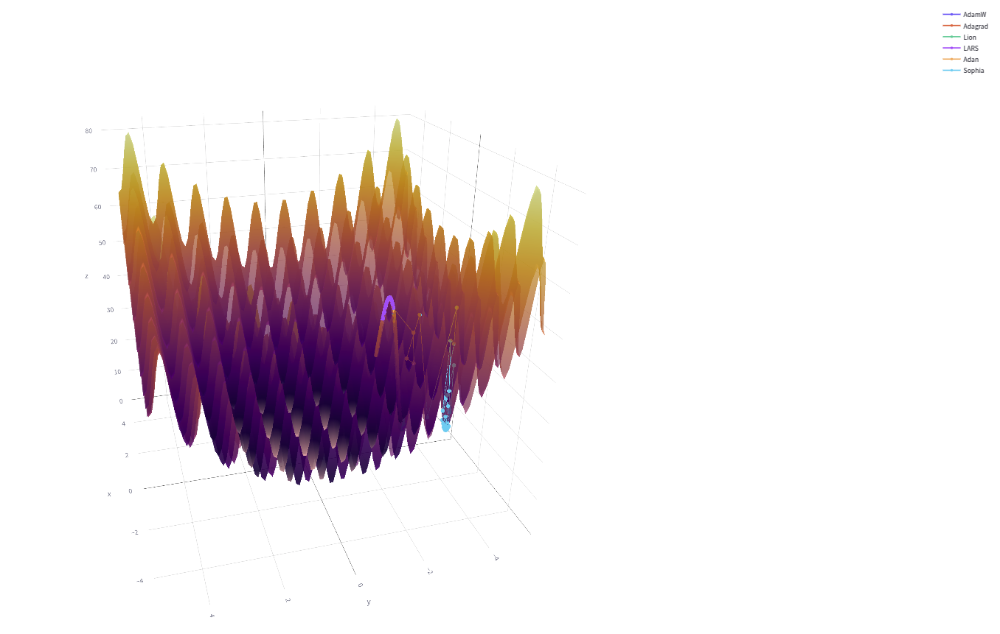
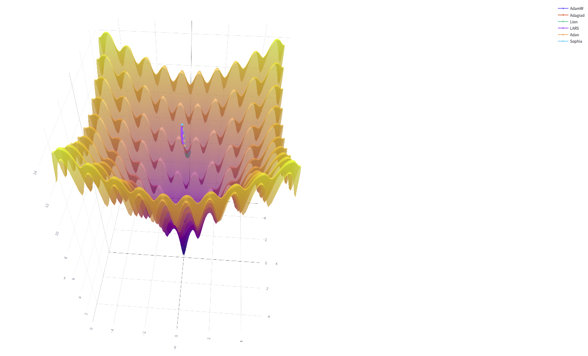

# 🧪 AI Optimizers Playground



[](https://www.python.org/)
[](https://streamlit.io/)
[](https://docs.pytest.org/)
[]
[](https://numpy.org/)
[](https://pandas.pydata.org/)

---

> **AI Optimizers Playground** — это интерактивная лаборатория для сравнения и исследования современных и классических оптимизаторов на различных математических функциях.  
> Интерфейс позволяет наглядно сравнивать траектории сходимости, анализировать метрики каждого оптимизатора и быстро подбирать гиперпараметры.  
> Краткая информация и рекомендации по каждому оптимизатору доступны прямо в [приложении](https://aiopt1mizersplayground.streamlit.app/).
> Серверам Streamlit(Free) тяжело быстро обработать сложные вычисления, поэтому обработка может занять время.
> **https://aiopt1mizersplayground.streamlit.app/**

---

## 🚩 Основные возможности

- Сравнение более чем **12 оптимизаторов** на одном графике
- **2D/3D визуализация** ландшафта функции и траекторий оптимизации ([пример](img/surface_example.png))
- Поддержка **10+ тестовых функций**: от простых до мультимодальных
- **Гибкая настройка** параметров: learning rate, momentum, weight decay, β-параметры, trust_coeff и др.
- **Анимация** траекторий по итерациям, экспорт результатов (CSV, JSON)
- Справка и рекомендации по выбору оптимизатора и тестовой функции прямо в интерфейсе
- Возможность добавления шума к градиентам для имитации стохастичности
- Краткая инфа по каждому методу (где лучше применять, плюсы/минусы)

---

## 👟 Быстрый старт

```bash
git clone https://github.com/Blase-AI/AIOptimizersPlayground
cd AIOptimizersPlayground
pip install -r requirements.txt
streamlit run app.py
```
После запуска перейдите по адресу http://localhost:8501

---

## 🏗️ Архитектура

```
optimizers/         # Реализации оптимизаторов (каждый в своем файле)
tests/              # Тесты (Pytest) для каждого оптимизатора
img/                # Скриншоты интерфейса и графиков
app.py              # Streamlit-приложение
requirements.txt    # Зависимости Python
README.md           # Этот файл
```

---

## 🧠 Сравнение оптимизаторов

Ниже приведена таблица всех реализованных оптимизаторов, их краткое описание, где применяют и какие типы нейросетей особенно выигрывают от применения данного метода.

| Название       | Класс/файл        | Описание/схема работы                       | Где хорош/тип архитектур      |
|----------------|-------------------|---------------------------------------------|-------------------------------|
| SGD            | SGD.py            | Классический стохастический градиентный спуск | Простые MLP, большие датасеты |
| GD             | GD.py             | Пакетный градиентный спуск                  | Теория, маленькие задачи      |
| RMSProp        | RMSProp.py        | Экспоненциальное сглаживание градиентов      | RNN, seq2seq                  |
| Adagrad        | Agrad.py          | Адаптивный lr для каждого веса              | NLP, sparse data              |
| Adam           | Adaptive.py       | Адаптивный моментум (β1, β2)                | CNN, трансформеры, универсален|
| AMSGrad        | AMSGrad.py        | Adam с гарантией сходимости                  | Когда обычный Adam “прыгает”  |
| AdamW          | Aw.py             | Adam + decoupled weight decay                | Современные CNN, Transformers |
| Sophia         | Sophia.py         | Адаптивный, использует приближение гессиана  | LLM, большие модели           |
| Lion           | L.py              | Sign-based momentum, быстрый и легкий        | Transformers, ViT             |
| LARS           | LARS.py           | Layer-wise Adaptive Rate Scaling             | Большие CNN, большие батчи    |
| Adan           | An.py             | Momentum + “lookahead” градиенты (3 момента) | Transformers, большие CNN     |
| MARS           | Make_vAriance_Reduction_Shine.py | MomentumSTORM-подобная variance reduction, momentum averaging, preconditioning        | LLM, pretraining, большие модели|
| Base           | BOptimizer.py      | Базовый класс для расширения                 | -                             |

<details>
<summary>📸 Пример работы оптимизаторов и интерфейса</summary>





</details>

---

## 🧩 Тестовые функции

Таблица функций, доступных для анализа (v — минимум функции):

| Название       | Формула / Описание                                                                 | Тип / Особенности                         | Глобальный минимум                                                   |
|----------------|-------------------------------------------------------------------------------------|--------------------------------------------|----------------------------------------------------------------------|
| Quadratic      | f(x, y) = x² + y²                                                                  | Простая, выпуклая                          | (0, 0)                                                               |
| Rastrigin      | f(x, y) = 20 + x² + y² − 10[cos(2πx) + cos(2πy)]                                   | Мультимодальная, осцилляции, ловушки       | (0, 0)                                                               |
| Rosenbrock     | f(x, y) = (1−x)² + 100(y−x²)²                                                      | Узкая долина, нелинейность                 | (1, 1)                                                               |
| Himmelblau     | f(x, y) = (x² + y − 11)² + (x + y² − 7)²                                           | 4 глобальных минимума                      | (3,2), (-2.805,3.131), (-3.779,−3.283), (3.584,−1.848)               |
| Ackley         | −20·exp(−0.2·√(0.5(x² + y²))) − exp(0.5[cos(2πx)+cos(2πy)]) + e + 20               | Много локальных минимумов                  | (0, 0)                                                               |
| Griewank       | f(x, y) = (x² + y²)/4000 − cos(x)·cos(y/√2) + 1                                   | Плато + частые локальные минимумы          | (0, 0)                                                               |
| Schwefel       | f(x, y) = 418.9829·2 − x·sin(√x) − y·sin(√y)                                  | Крайне сложная, минимум вне центра         | (420.9687, 420.9687)                                                 |
| Levy           | f(x, y) = sin²(3πx) + (x−1)²[1+sin²(3πy)] + (y−1)²[1+sin²(2πy)]                   | Локальные плато и спады                    | (1, 1)                                                               |
| Beale          | f(x, y) = (1.5−x+xy)² + (2.25−x+xy²)² + (2.625−x+xy³)²                            | Сложная, узкие долины                      | (3, 0.5)                                                             |

<details>
<summary>📸 Скриншоты ландшафтов</summary>





</details>

---

## 🖥️ Интерфейс и сценарии работы

- **Боковая панель**: выбор оптимизаторов, настройка гиперпараметров, тестовой функции, визуализации, шумов.
- **Главная вкладка**: сравнение траекторий оптимизаторов на выбранной функции (2D/3D, анимированная визуализация).
- **Метрики**: финальный loss, средняя норма градиента, динамика по итерациям.
- **Описание**: краткая справка по каждой функции и оптимизатору, рекомендации по применению.
- **Руководство**: как использовать интерфейс, советы по настройке, описание параметров.

---

## 💡 Рекомендации по применению

- **SGD, GD**: для небольших, простых задач (MLP, классика)
- **Adam, AdamW**: универсальны, подходят почти под все архитектуры (CNN, Transformer)
- **Lion, LARS, Adan**: эффективны на больших моделях, трансформерах, vision
- **RMSProp, Adagrad**: хороши для RNN, NLP, задач с разреженными признаками
- **AMSGrad**: когда обычный Adam нестабилен
- **Sophia, MARS**: экспериментальные, для исследований и LLM

---

## 🧪 Тесты

- Каждый оптимизатор снабжен отдельным тестом (`tests/`), который проверяет корректность шагов, edge-cases, работу трекинга истории и параметров.
- Используйте:
  ```bash
  pytest tests/
  ```

---

## 🛠️ Как добавить свой оптимизатор?

1. Реализуйте класс в `optimizers/` (наследуйте от `BaseOptimizer`).
2. Добавьте тест в `tests/`.
3. Зарегистрируйте оптимизатор в функции `init_optimizer` в `app.py`.
4. (Опционально) Добавьте описание/подсказки для UI.

---


## 📝 Лицензия и авторы

- **Лицензия:** MIT
- **Автор:** [Blase-AI](https://github.com/Blase-AI)
- Вопросы, предложения — через Issues или Pull Requests!

---
